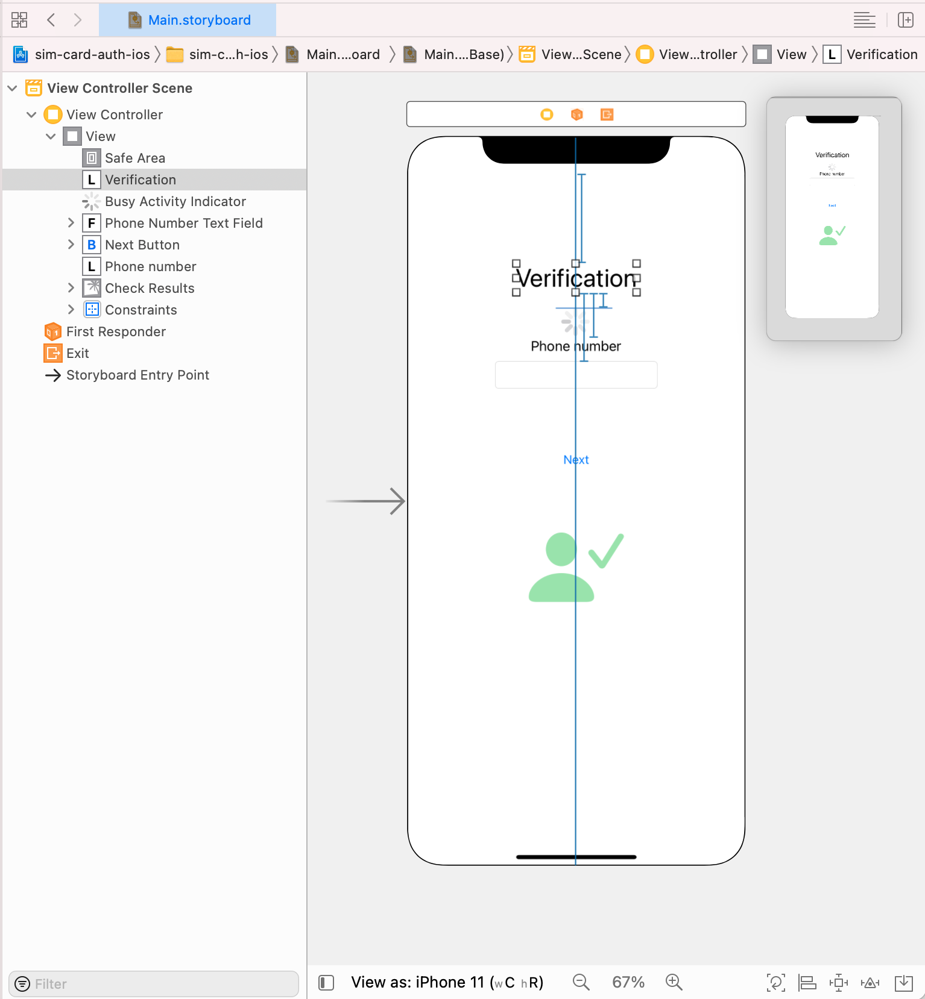
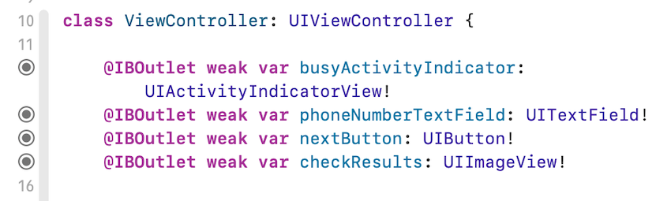
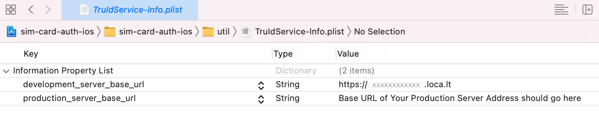
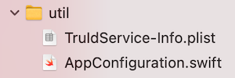
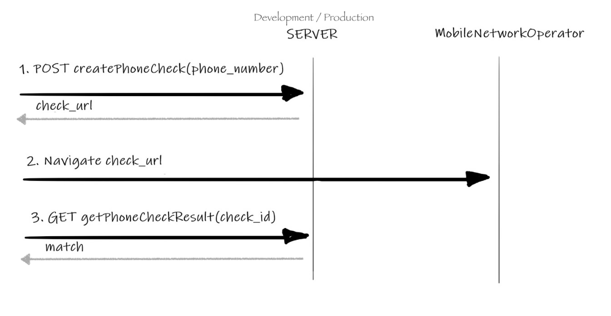
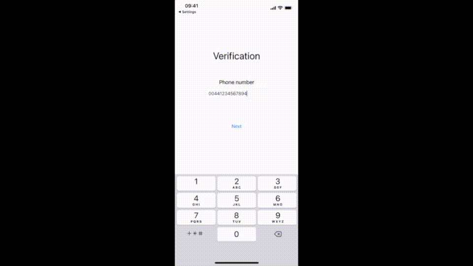

# How to Add SIM Card Based Mobile Authentication to your iOS App [with tru.ID](https://tru.id)

**tru.ID** [SubscriberCheck](https://developer.tru.id/docs/subscriber-check) offers both mobile phone number verification and SIM swap detection. SubscriberCheck achieves this by combining the workflows of [PhoneCheck](https://developer.tru.id/docs/phone-check), which confirms the ownership of a mobile phone number by verifying the possession of an active SIM card with the same number, with [SIMCheck](https://developer.tru.id/docs/sim-check) which provides information on when a SIM card associated with a mobile phone number was last changed. SubscriberCheck can be used when augmenting existing 2FA or anti-fraud workflows.

In this tutorial, we will walk you through how to build a simple iOS application which integrates **tru.ID** SubscriberCheck as your application's authentication workflow.

If you'd prefer to go directly to the completed code, it's in the [sim-card-auth-ios](https://github.com/tru-ID/sim-card-auth-ios/) Github repository.

## Before you begin

For development you'll need:

- [Xcode 12](https://developer.apple.com/xcode/)
- An Apple developer account via the [Apple Developer Portal](https://developer.apple.com/account/)
- An iPhone or an iPad with a SIM card with an active data connection
- [Node.js](https://nodejs.org/en/download/) installed for the **tru.ID** CLI

With the above in place, let's dive straight into adding SubscriberCheck functionality to your iOS applications.

## Set-up the **tru.ID** CLI and Run a Development Server

**tru.ID** provides a [**tru.ID** CLI](https://github.com/tru-ID/cli) to quickly set up a development environment and provide a development server on your machine.

The development server acts as a proxy in between your mobile app and the **tru.ID** servers. It also opens up a local tunnel that makes the server publicly accessible over the Internet so your mobile device can still connect to it when on cellular data. This architecture and the development server means you can focus on the mobile application development. 

Your production architecture should mirror this client/server architecture (but may not be the same API) with your servers acting as a secure proxy to the **tru.ID** APIs. See the [SubscriberCheck Workflow Integration guide](https://developer.tru.id/docs/subscriber-check/integration) for more details.

With the background information out of the way, sign up for a [**tru.ID** account](https://developer.tru.id/signup) account. The account comes with some free credits which you can use during the development as well as testing your app against the production environment when it is ready.

Next, install the [**tru.ID** CLI](https://github.com/tru-ID/cli):

```bash
npm install -g @tru_id/cli
```

Run the `tru setup:credentials` command with the credentials you can copy from the [**tru.ID** console](https://developer.tru.id/console):

```bash
tru setup:credentials {client_id} {client_secret} {data_residency}
```

Install the CLI [development server plugin](https://github.com/tru-ID/cli-plugin-dev-server):

```bash
tru plugins:install @tru_id/cli-plugin-dev-server@canary
```

Create a new **tru.ID** project:

```bash
tru projects:create iOSAuthDemoServer
```

This saves a `tru.json` **tru.ID** project configuration to `./iosauthdemoserver/tru.json`.

Run the development server, by pointing it to the newly created project directory and configuration.

```bash
tru server -t --project-dir ./iosauthdemoserver
```

Check that the URL that is shown in the terminal is accessible in your web browser. The URL is in the format `https://{subdomain}.loca.lt`. This is the public accessible URL to your local development server.


## Create a New iOS Project

With the **tru.ID** account created and the development server up and running, we can make a start with the application. You can skip this step if you already have an iOS project. Otherwise;

* Launch your Xcode
* File -> New -> Project
* In the "Choose a template for your new project" modal, select **App** and click Next
* Set "sim-card-auth-ios" as the Product Name, however, you can use what ever the name of your project is
* Select your Team, and make sure to assign an organization identifier using a reverse domain notation
* Keep it simple, and use a **Storyboard**, **UIKit App Delegate** and **Swift** as the development language
* Uncheck **Use Code Data** if it is checked, and click Next
* Select the folder you want to store your project and click Next

As you see, it is a pretty simple project with a single ViewControlller. At this point, you do not need to worry about the `AppDelegate` or `SceneDelegate`. This is enough to demostrate SubscriberCheck.

If you already have Xcode and have added your developer account (Xcode->Preferences->Accounts), Xcode takes care of generating necessariy certificates and provisioning profiles in order to install the app on the device.

### Let's Build the User Interface

Navigate to the `Main.storyboard`. You need to add a few UI components to receive input from the user, and provide feedback:

- Add a UILabel to the View Controller's view as a title with a text "Verification"
- An UIActivityIndicator (Large) to show/hide progress when you perform a SubcriberCheck
- A UILabel with a text "Phone number" to indicate what the next text field is for
- A UITextField so that user can enter their phone number
- A UIButton to trigger the SubscriberCheck request
- An UImageView to show whether SubcriberCheck is successful or not

All UI components are Horizontally aligned in the container using constraints. You should also need to define constraints to anchor the componets as well. Start with the top "Verification" `UILabel` and specify the alignment between the Safe Area and the label. Do the same for all other componets, define a constraint for the Top space, and where necessary add additional constraints for width and height.

The view layout should look like this:



There are a few configuration options you should add for these UI components.

- Phone number `UITextField`: Select the text field, and on the **Attributes Inspector**, scroll to `Text Input Traits` and change the `Content Type` to `Telephone Number`. Also, change the `Keyboard Type` to `Phone Pad`.
- `UIActivityIndicator`: Select the activity indicator, and on the **Attributes Inspector** check `Hides When Stopped`
- `UIImageView`: Select the `UIImageView`, and on the **Attributes Inspector**, scroll to Drawing, and check `Hidden`

Now, you need to define Outlets in the ViewController so that you can control the UI state. Let's select `ViewController` in Xcode, and then by using the `⌥` select `Main.storyboard` file. Both `ViewController.swift` and `Main.stroyboard` should be opened side by side.

Select the `UIActivityIndicator` you inserted to the storyboard, and with `⌃` key pressed drag a connection from the storyboard to the `ViewController.swift`. Xcode indicates possible places in the Editor where you can create an Outlet. 

When you are happy, release the keys and mouse/trackpad. You will be prompted to enter a name for the variable, type `busyActivityIndicator`.

You need to connect the `UITextField`, `UIButton` and the `UIImageView` as well. Let's perform the above steps for these as well respectively, and name them as follows:

- phoneNumberTextField
- nextButton
- checkResults



This allows you to retrieve the phone number entered by the user, and control the state to provide feedback. You now have one last task to do related to the storyboard.

Let's insert an action. When user taps on the **Next** button, you want the `ViewController` to know that user wants to initiate the SubcriberCheck. So select the `Next` button, and with your `⌃` key pressed drag a connection from the storyboard to the `ViewController.swift`. Xcode indicates possible places where you can create an `IBAction`. When you are happy, release the keys and mouse/trackpad. You will be prompted to enter a name for the method, type `next` and Xcode will insert the method with a `IBAction` annotation.

It is time to write some code to manage the UI state. The first method you are going to add is `controls(enabled: Bool)`. This method helps us show or hide the `checkResults`, and  `busyActivityIndicator`. You should also disable the `phoneNumberTextField` when the SubcriberCheck flow is in progress.

```swift
// MARK: UI Controls Configure || Enable/Disable

private func controls(enabled: Bool) {

    if enabled {
        busyActivityIndicator.stopAnimating()
    } else {
        busyActivityIndicator.startAnimating()
    }

    phoneNumberTextField.isEnabled = enabled
    nextButton.isEnabled = enabled
    checkResults.isHidden = !enabled
}

private func configureCheckResults(match: Bool, noSimChange: Bool) {
    
    if match {
        let image = UIImage(systemName: "person.fill.checkmark")
        self.checkResults.image = image?.withRenderingMode(.alwaysTemplate)
        self.checkResults.tintColor = .green
    } else {
        let image = UIImage(systemName: "person.fill.xmark")
        self.checkResults.image = image?.withRenderingMode(.alwaysTemplate)
        self.checkResults.tintColor = .red
    }
}
```
You will use these methods later in the `next(_ sender: Any)` that is triggered by the user tapping the `Next` button.

### Models, Structs & Protocols

Now is the time to create a new group called `service` in the Project Navigator. In here you'll implement Model layer classes, structs, protocols and enums. Note that none of the files in this group should be importing `UIKit`.

Create a Swift file in the `service` group called `SessionEndpoint.swift`. In this file, we define a protocol called `Endpoint` and  `NetworkError` of type Enum and a class which implements the protocol. Let's define the protocol `Endpoint` and `NetworkError` enum as in the following in this file.

```swift
import Foundation

protocol Endpoint {
    var baseURL: String { get }
    func makeRequest<U: Decodable>(urlRequest: URLRequest,
                     handler: @escaping (Result<U, NetworkError>) -> Void)
    
    func createURLRequest(method: String,
                          url: URL,
                          payload:[String : String]?) -> URLRequest
}

enum NetworkError: Error {
    case invalidURL
    case connectionFailed(String)
    case httpNotOK
    case noData
}
```

The purpose of  the `Endpoint` protocol is to hide implementation details from the client of this protocol. It has two methods and a variable `baseURL`. It represents one REST API endpoint. We'll come back to this in more detail later.

Next, define our model object which holds SubscriberCheck results.

Create a Swift file called `SubscriberCheck.swift` in the `service`, and implement a struct with the same name as below:

```swift
import Foundation

// Response model based on https://developer.tru.id/docs/reference/api#operation/create-subscriber-check
struct SubscriberCheck: Codable {
    let check_id: String?
    let check_url: String?
    let status: SubcriberCheckStatus?
    let match: Bool?
    let no_sim_change: Bool?
}

enum SubcriberCheckStatus: String, Codable {
    case ACCEPTED
    case PENDING
    case COMPLETED
    case EXPIRED
    case ERROR
}
```

**tru-ID** [REST API](https://developer.tru.id/docs/reference/api#operation/create-subscriber-check) documentation provides us the basis for this struct. In production, your architecture and servers may expose a different REST response model. Also important to note that `SubscriberCheck` implements the `Codable` protocol as this will help `JSONSerialization.data(..)` to decode the json response to the `SubscriberCheck` easily.

Next, define a protocol which will help the View layer to talk to the Model layer implementation.

The View layer of our application is concerned about what the user is going to request. At this layer, you shouldn't be concerned about "How" it is going to be done. Since it is all about SubscriberCheck, simple `Subscriber` protocol which defines a function to receive a phone number and provides a closure for the SubscriberCheck results should be sufficient. 

Create a Swift file in the `service` group called `SubscriberCheckService.swift`. In this file, define the `Subscriber` protocol as the following:

```swift
protocol Subscriber {
    func check(phoneNumber: String,
               handler: @escaping (Result<SubscriberCheck, NetworkError>) -> Void)
}
```

Create a class called `SubscriberCheckService` in the existing `SubscriberCheckService.swift` file which implements the `Subscriber` protocol.

```swift
final class SubscriberCheckService: Subscriber {
    let path = "/subscriber-check"
        
    init(){        
    }
    
    public func check(phoneNumber: String, handler: @escaping (Result<SubscriberCheck, NetworkError>) -> Void) {
     //Implement the workflow
    }
}
```

A variable called `path` is defined to hold the path for the development server endpoint to perform the necessary calls. The path is `/subscriber-check` for the local development server. The `check(phoneNumber: ...)` method will contain the logic for the workflow.

### Implement the User Action

At this point, the UI is almost ready to execute the SubscriberCheck workflow. Let's first define a variable of `Subscriber` type in our `ViewController` and then implement the `next(_ sender: Any)` IBAction we previously created. 

Add the following code to the `ViewController`.

```swift
var subscriberService: Subscriber!

override func viewDidLoad() {
    super.viewDidLoad()
    subscriberService = SubscriberCheckService()
}
```

This initialises `subscriberService` with a concrete implementation `SubscriberCheckService` which you defined in the previous section. `SubscriberCheckService` knows how to execute the workflow and all `ViewController` needs to do is to call `check(phoneNumber: String, ..)` method and control the UI state. It is time to implement the `next(_ sender: Any)`. It looks as follows:

```swift
@IBAction func next(_ sender: Any) {

    guard let phoneNumber = phoneNumberTextField.text else {
        return
    }

    if !phoneNumber.isEmpty {
        // Ideally you should validated phone number against e164 spec
        // Without leading + or 0's
        // For example: {country_code}{number}, 447940448591
        // Remove double 00's
        var strippedPhoneNumber = phoneNumber.trimmingCharacters(in: .whitespacesAndNewlines)
        if let range = strippedPhoneNumber.range(of: "00") {
            strippedPhoneNumber.replaceSubrange(range, with: "")
        }

        controls(enabled: false)

        subscriberService.check(phoneNumber: strippedPhoneNumber) { [weak self] (checkResult) in

            DispatchQueue.main.async {
                switch checkResult {
                case .success(let subscriberCheck):
                    self?.configureCheckResults(match: subscriberCheck.match ?? false, noSimChange: subscriberCheck.no_sim_change ?? false)
                case .failure(let error):
                    print("\(error)")
                }
                self?.controls(enabled:true)
            }

        }
    }

}
```

The implementation of the `next` method first checks whether there is text in the `phoneNumberTextField` and whether it is empty or not.

Note that in a production code, you should validate the phone number against the [E.164 specification](https://www.itu.int/rec/T-REC-E.164-201011-I/en). We are keeping it simple for the purposes of this tutorial and only removing `00` from the begining of the phone number if exists and trimming.

 The second step is to disable parts of the user interface, show the activity indicator and let it spin when the user taps the **Next** button. The third step is to call the `check(phoneNumber:)` method of the `subscriberService`. The handler will provide a `checkResult` which is of type `Result<SubscriberCheck,NetworkError>`. Note that this closure will not be called in the main queue, therefore you need to wrap any code which accesses UIKit in a `DispatchQueue.main.async`.

If the workflow executes successfully then you can access the model details and reconfigure the UI. Note that the `.success` case doesn't necessarily mean that validation is successful, it is simply an indication that workflow executed without encountering any network errors.

In order to understand if you validated the phone number you need to inspect the `.success` payload which is of type `SubscriberCheck`. The following line will ensure that validation results are reflected in the UI:

```swift
self?.configureCheckResults(match: subscriberCheck.match ?? false, noSimChange: subscriberCheck.no_sim_change ?? false)
```

In any case, you restore the UI controls back to their original state with the following code so that the user can re-execute the workflow, if needed:

```swift
self?.controls(enabled:true)
```
 
 ### Setup the Network and Define Endpoints

 Your app may have its own ways for defining and access external service URLs, and these endpoints may be stored in configuration files such as a plist, or in your Swift code. In this tutorial, you store the development and production base URLs in a plist called `TruIdService-Info.plist`. These server endpoints proxy some of the requests through to the **tru.ID** API.
 
Create group called `util` in the Project Navigator. Next, create the Property List:

* File -> New -> File
* Select Property List in the dialog
* Click Next
* Select where you want to store the file (default selected folder should be fine)
* Type `TruIdService-Info` as the file name
* Click Create
 
 You should see this file created in the `util` group. Now, let's add two keys to this `plist` file; one for the development endpoints and one for the production endpoints. The values should be String type.

 ```
 development_server_base_url
 production_server_base_url
 ```

 
 
 You must ensure to assign the correct value to the `development_server_base_url` in order to complete this tutorial and successfully run the app on your device. This value is the one you are provided from the Terminal when you set-up and ran your development server at the begining of this tutorial (e.g. `https://{subdomain}.loca.lt`). For production set-up, you should implement your own backend and add this URL here in the `production_server_base_url`.

 In order to read the plist, create a `struct` called `AppConfiguration`, which deals with loading the correct endpoint so you do not have to worry when you are implementing the use cases.



```swift
import Foundation

struct AppConfiguration {
    
    let defaultConfigurationName = "TruIdService-Info"
    var configuration: [String : Any]?

    mutating func loadServerConfiguration() {
        if  let path = Bundle.main.path(forResource: defaultConfigurationName, ofType: "plist"),
            let xml = FileManager.default.contents(atPath: path)
        {
            self.configuration = (try? PropertyListSerialization.propertyList(from: xml,
                                                                              options: .mutableContainersAndLeaves,
                                                                              format: nil)) as? [String : Any]
        }
    }

    func baseURL() -> String? {
        var key = "production_server_base_url"
        #if DEBUG
        key = "development_server_base_url"
        #endif
        return configuration?[key] as? String
    }

}
```

The `AppConfiguration` struct simply reaches into the main bundle and searches for a `plist` called `TruIdService-Info`. If found, it reads the plist as a dictionary and binds that to the `configuration` variable. This URL is provided to the clients of the struct via the `baseURL() -> String?` method.

Now, implement a class called `SessionEndpoint` with in the existing `service/SessionEndpoint.swift` file. This is our implementation of simple network requests using `URLSession`. You can implement this protocol using URLSession, or with Alamofire. For the purposes of this tutorial, let's keep it simple and implement the protocol using URLSession.

```swift
final class SessionEndpoint: Endpoint {

    let baseURL: String
    private let session: URLSession

    init() {
        var configuration = AppConfiguration()
        configuration.loadServerConfiguration()
        baseURL = configuration.baseURL()!//Fail early so that you know there is something wrong
        session = SessionEndpoint.createSession()
    }

    private static func createSession() -> URLSession {

        let configuration = URLSessionConfiguration.ephemeral //you do not want OS to cache or persist
        configuration.allowsCellularAccess = true
        configuration.waitsForConnectivity = true
        configuration.networkServiceType = .responsiveData

        return URLSession(configuration: configuration)
    }
    
    // MARK: Protocol Implementation
    func makeRequest<U: Decodable>(urlRequest: URLRequest,
                     handler: @escaping (Result<U, NetworkError>) -> Void) {
        
        let task = session.dataTask(with: urlRequest) { (data, response, error) in

            if let error = error {
                handler(.failure(.connectionFailed(error.localizedDescription)))
                return
            }

            guard let httpResponse = response as? HTTPURLResponse,
                  (200...299).contains(httpResponse.statusCode) else {
                handler(.failure(.connectionFailed("HTTP not OK")))
                return
            }

            guard let data = data else {
                handler(.failure(.noData))
                return
            }

            print("Response: \(String(describing: String(data: data, encoding: .utf8)))")

            if let dataModel = try? JSONDecoder().decode(U.self, from: data) {
                    handler(.success(dataModel))
                return
            }
        }

        task.resume()
    }

    func createURLRequest(method: String, url: URL, payload:[String : String]?) -> URLRequest {

        var urlRequest = URLRequest(url: url)
        urlRequest.setValue("application/json; charset=utf-8", forHTTPHeaderField: "Content-Type")
        urlRequest.httpMethod = method

        if let payload = payload {
            let jsonData = try! JSONSerialization.data(withJSONObject: payload, options: .prettyPrinted)
            urlRequest.httpBody = jsonData
        }

        return urlRequest
    }
}
```

The `init()` method of the class loads a base URL from the `AppConfiguration` which you defined earlier. It returns a URL either for a development server or a production server depending on the build scheme. The final line of the `init()` creates a URLSession using a private static method. Note that `createSession()` method creates a session configuration which doesn't cache or persist network related information; it is `ephemeral` for additional security.

The rest of the file contains the `Endpoint` protocol implementation. The first method, `makeRequest<>..`, creates a data task using the `URLRequest` provided and initates the call. When the reponse is received, the method calls the `handler` closure for success or failure cases. If data exists and there are no error scenarios, it attempts to decode the data to the model type provided.

The `Result<>` generic type refers to a model object and an `Enum` which provides error cases.

The `createURLRequest(..)` method receives three parameters; HTTP method name, the URL and an optional payload if the request is a POST request, for instance. The method returns a `URLRequest` object, which is then used by the `makeRequest<>..` method during the execution of the workflow.

### Implement the Workflow

Now that you have defined the user interface and network request/response mechanics, let's bridge the two and implement the business logic. It is time talk about the SubscriberCheck workflow before you dive more into the coding.

The SubscriberCheck workflow has 3 steps:

1. Create a SubscriberCheck via the server, this will return a `check_id` and `check_url`.
2. Then request the `check_url` retrieved in step 1 using the **tru.ID** iOS SDK
3. As soon as `check_url` request returns, retrieve the SubscriberCheck results using the `check_id` retrieved in step 1

The following sequence diagram shows each step.

**TODO (Phil): update to use MermaidJS**



Let's implement the workflow in `SubscriberCheckService` using some helper methods and the classes you created in the previous sections.

First, Let's add a variable called `endpoint` to the `SubscriberCheckService` and initiate it in the `init()` method. The `SubscriberCheckService` class uses a concrete implementation of `Endpoint` protocol called `SessionEndpoint` which you defined in the previous sections. This class makes our life easy to execute network calls. 

```swift
final class SubscriberCheckService: Subscriber {
    let path = "/subscriber-check"
    let endpoint: Endpoint
        
    init(){
        self.endpoint = SessionEndpoint()
    }
    ...
}
```

Let's also define three methods, each corresponding to the steps mentioned above. Later, we will stitch the steps of the workflow in `check(phoneNumber: ...)` method.

The first method is `cresteSubscriberCheck(phoneNumber:...)`. It makes a `POST` request to the server to create a SubscriberCheck. This call can be made over any type of network (cellular/wifi). The server should return a SubscriberCheck `check_url`.

Add the following method to the `SubscriberCheckService` class:

```swift
private func createSubscriberCheck(phoneNumber: String,
                                     handler: @escaping (Result<SubscriberCheck, NetworkError>) -> Void) {
    let urlString = endpoint.baseURL + path

    guard let url = URL(string: urlString) else {
        handler(.failure(.invalidURL))
        return
    }

    let phoneNumberDict = ["phone_number" : phoneNumber]
    let urlRequest = endpoint.createURLRequest(method: "POST", url: url, payload: phoneNumberDict)
    endpoint.makeRequest(urlRequest: urlRequest, handler: handler)
}
```

This method receives a phone number, constructs the full URL using the `endpoint.baseURL` and the SubscriberCheck `path` which is defined by the server. It creates a payload (just the phone number), and a `URLRequest` using the `endpoint.createURLRequest(..)` method. Then the method uses the `makeRequest(..)` method of the endpoint and pass the `urlRequest` and the handler.

Our next method is called `retrieveSubscriberCheck(..)`. Add it to the `SubscriberCheckService` class:

```swift
private func retrieveSubscriberCheck(checkId: String,
                                     handler: @escaping (Result<SubscriberCheck, NetworkError>) -> Void) {

    let urlString = endpoint.baseURL + path + "/" + checkId

    guard let url = URL(string: urlString) else {
        handler(.failure(.invalidURL))
        return
    }

    let urlRequest = endpoint.createURLRequest(method: "GET", url: url, payload: nil)

    endpoint.makeRequest(urlRequest: urlRequest, handler: handler)
}
```

This is very similar to the first method you defined, with a few differences. You are now calling the endpoint with a extra `checkId` parameter, and this time it is a `GET` call. This method will get the results of the check performed.

The third method we need to create is doing the heavy lifting using the **tru.Id** SDK. Let's create a  method called `requestSubscriberCheckURL(..)`:

```swift
private func requestSubscriberCheckURL(subscriberCheckURL: String,
                                       handler: @escaping () -> Void) {

}
```

This method requests the `check_url` which will be returned by the `createSubscriberCheck(..)`. In order to do that you need the **tru.Id** [iOS SDK](https://github.com/tru-ID/tru-sdk-ios). Let's add it to our project. 

The **tru.Id** iOS SDK ensures that certain network calls are done on a Celluar network type, which is needed to run SubcriberCheck workflow. You have two options to add the SDK to your project.

#### Using Swift Package Manager

Xcode integrates well with Github, and you can add Swift Packages very easily. In your Xcode, go to File -> Swift Packages -> Add Package Dependency...

Type `https://github.com/tru-ID/tru-sdk-ios.git`, and tap **Next**.

Xcode will find the package, select the latest version and then tap **Finish** to add it. Now that the SDK is added, you can import it when you are implementing the workflow.

#### Using CocoaPods

While we recommend using Swift Package Manager, **tru.ID** iOS SDK also supports adding your dependencies via CocoaPods. If you are familiar with CocoaPods and prefer using it, all you need to do is to create a Podfile and add the **tru.ID** pod the following way:

```
target 'MyApp' do
  pod 'tru-sdk-ios'
end
```

Make sure to run `pod install` in your project directory. After the CocoaPods install all necessary pods, and configure your project, don't forget to open the workspace rather than the project file.

### Request the check_url

Let's go back to the `SubscriberCheckService` and import the `TruSDK`:

```swift
import TruSDK
```

Then add using the SDK to the `requestSubscriberCheckURL(..)` to request the `check_url`:

```swift
private func requestSubscriberCheckURL(subscriberCheckURL: String,
                                       handler: @escaping () -> Void) {

    let tru = TruSDK()

    tru.openCheckUrl(url: subscriberCheckURL) { (something) in
        handler()
    }
}
```

It's that simple.

As discussed, the SDK will ensure that this call will be made over the cellular network. When the `openCheckUrl(..)` calls the closure, you call the `handler` as well. You are yet to implement the `SubscriberCheckService` `check(phoneNumber:...)` method, and chain the methods in our `check(phoneNumber: String..` method.

So, let's do that:

```swift
public func check(phoneNumber: String, handler: @escaping (Result<SubscriberCheck, NetworkError>) -> Void) {

    createSubscriberCheck(phoneNumber: phoneNumber) { (createResult) in
        var checkURL = ""
        var checkID = ""

        switch createResult {
        case .success(let subscriberCheck):
            // The server returns the SubscriberCheck results to the device.
            checkURL = subscriberCheck.check_url!
            checkID = subscriberCheck.check_id!
            print("Got the subscriber check URL: \(String(describing: subscriberCheck.check_url)) ")
        case .failure(let error):
            handler(.failure(error))
            return
        }

        print("Using the SDK to request check URL over mobile network")
        self.requestSubscriberCheckURL(subscriberCheckURL: checkURL) { [weak self] in

            guard let self = self else {
                return
            }

            print("SDK successfully returned, let's call our server to retrieve check results.")
            self.retrieveSubscriberCheck(checkId: checkID) { (checkResult) in
                switch checkResult {
                case .success(let checkResultModel):
                    handler(.success(checkResultModel))
                case .failure(let error):
                    handler(.failure(error))
                }

            }
        }
    }

}
```

First, you make a call using the `createSubscriberCheck(phoneNumber: phoneNumber) ...` method. The callback to this method inspects the `Result<>`. If it is a success it fetches the `checkURL` and `checkID` and stores them in local variables which will be used later.

Within the callback you execute the second step using `requestSubscriberCheckURL(...)`. This method uses **tru.ID** iOS SDK and makes a call to  `check_url`. The SDK makes this call over the cellular network so the user must have a data plan. Behind the scenes this call will redirect and eventually return OK. All this will be handled by the SDK.

The third step is to make a final request to the server using the `checkID` that you've got as a result of making the first call. This call will return the SubscriberCheck result; whether the check is successful or not.

### Perform your first SubscriberCheck

Now that our code is complete, you can run the application on a real device. Bear in mind that SIM card based authentication is not be possible on a Simulator as you require a SIM Card with an active data connection.

**TODO: use .mp4 in docs**

[Subscriber Check on iOS](https://user-images.githubusercontent.com/6573797/111884103-2ce29780-89b7-11eb-864a-d47a21fec71b.mp4)



## Where next?

 - The completed sample app can be found in the **tru.ID** [sim-card-auth-ios](https://github.com/tru-ID/sim-card-auth-ios/) Github repository.
 - Take a look at the [**tru.ID** iOS SDK on GitHub](https://github.com/tru-ID/tru-sdk-ios)

## Troubleshooting

If you have any questions please [raise an issue](https://github.com/tru-ID/tru-sdk-ios/issues) on the GitHub repo.

### Mobile Data is Required

Don't forget that the SubcriberCheck validation requires your mobile device to have data plan from your network operator and you should enable mobile data.

### Get in touch

If you have any questions, get in touch via [help@tru.id](mailto:help@tru.id).

